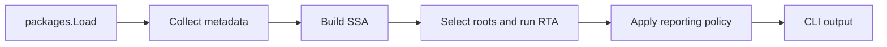

# Architecture

`unusedfunc` reports declarations that are not reachable from the selected program roots. It is a static analysis tool. Dynamic uses outside its rules need a suppression.

## Components

| Component | Responsibility |
|---|---|
| `cmd/unusedfunc` | Flags, output, and exit status |
| `pkg/unusedfunc` | Package loading, metadata collection, and coordination |
| `pkg/ssa` | SSA construction, root selection, and RTA integration |
| `internal/rta` | Reachability for direct calls, dynamic calls, and interfaces |
| `internal/analysis` | Reporting policy |
| `pkg/assembly`, `pkg/runtime`, `pkg/suppress` | Dynamic-use metadata |

The loader includes test variants and full type information. SSA includes loaded dependencies, but root selection considers target packages only.

## Roots and Reporting

Roots include `main`, `init`, `Test*`, `Benchmark*`, and `Example*` declarations. Normal mode also roots public functions and methods in packages outside `main` and `/internal`; strict mode does not. Runtime directives, CGo exports, package-local assembly calls, and exported assembly implementations outside `main` have special handling. RTA finds direct `runtime.SetFinalizer` callbacks while it visits reachable calls.

| Declaration | Normal mode | Strict mode |
|---|---|---|
| Unexported | Report when unused | Report when unused |
| Exported in `/internal` or `main` | Report when unused | Report when unused |
| Other exported declaration | Keep as public API | Report when unused |

Suppressions and declarations with runtime, linkname, CGo, or assembly metadata do not report. Suppressions do not create roots.

## Reachability Boundaries

RTA uses worklists for direct calls, function values, interface invokes, interface conversions, assertions, and interface-to-interface conversions. It uses fingerprints before `types.Implements` to reject impossible matches.

Known serialization, formatting, and SQL calls limit method retention for empty-interface conversions. Direct `reflect.ValueOf` and `reflect.TypeOf` arguments retain exported methods. The analyzer does not resolve template text, method-name strings, tags, or general reflection value flow. See [known limitations](reference/known-limitations.md).

Generic instantiations retain their origin templates. Public generic templates without local instantiations use a typed-AST fallback that follows references and adds concrete helpers as RTA roots. It does not model general value flow through containers or generic call chains.

## Tests

`internal/harness` discovers immediate `testdata/*/expected.yaml` fixtures. A fixture can set build tags, CGo, GOOS, GOARCH, strict mode, expected findings, and expected errors. The harness compares canonical function names and optional file suffixes. See [workflows](workflows.md) for fixture steps.
